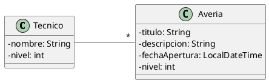

# Gestión de partes de avería

Queremos construir una aplicación que permita gestionar las averías que se producen en los equipos informáticos de las
aulas de Arriaga.

El diagrama de clases que describe la información que tenemos que gestionar es el siguiente:



Las averías y los técnicos tienen niveles asignados, de 1 a 3.

El programa mostrará un menú como el siguiente:

```plaintext
1. Alta de técnico.
2. Gestión de averías
	a. Nuevo parte de avería.
	b. Asignar avería a técnico.
	c. Atender avería.
3. Listados
	a. Listado de averías sin resolver de un técnico.
	b. Listado de todas las averías de un técnico (resueltas y no resueltas).
	c. Listado de todas las averías del sistema y técnico asignado.
4. Salir
```

El flujo de trabajo del sistema es el siguiente:

- Los técnicos atienden las averías por orden de llegada.
- Cuando un técnico atiende una avería, esta puede quedar resuelta o no.
- Si el nivel del técnico es mayor o igual que el de la avería, se resuelve. Si no, no.
- Si la avería se resuelve, deja de estar pendiente.
- Si no se resuelve, vuelve a entrar en la lista de pendientes, en último lugar, disminuyendo en uno el nivel de la
  avería.

## Sugerencias

- Pueden utilizarse las estructuras de datos que se consideren adecuadas para resolver el problema, justificando la
  elección.

## Restricciones

- No hay límite en el máximo de técnicos y averías diferentes que podemos almacenar en el sistema.
- En las clases del proyecto, solo se pueden añadir las propiedades estrictamente necesarias para mantener la asociación
  entre los objetos. Ninguna más.
- El programa no termina hasta que se elija la opción de salir.
- Es obligatorio tratar las posibles excepciones de forma adecuada.
